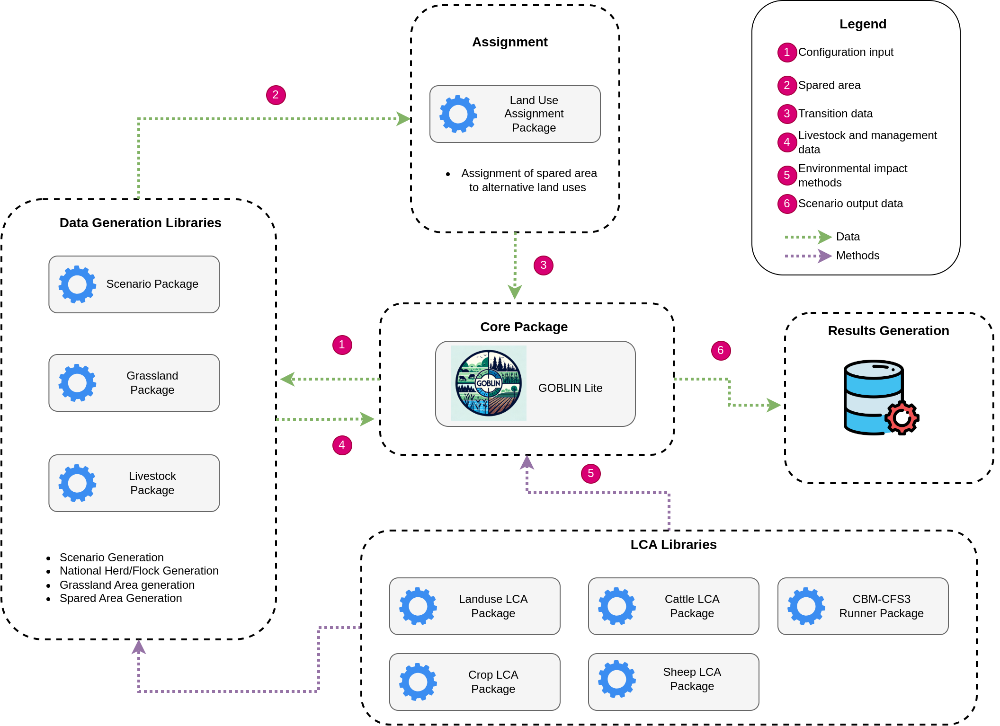
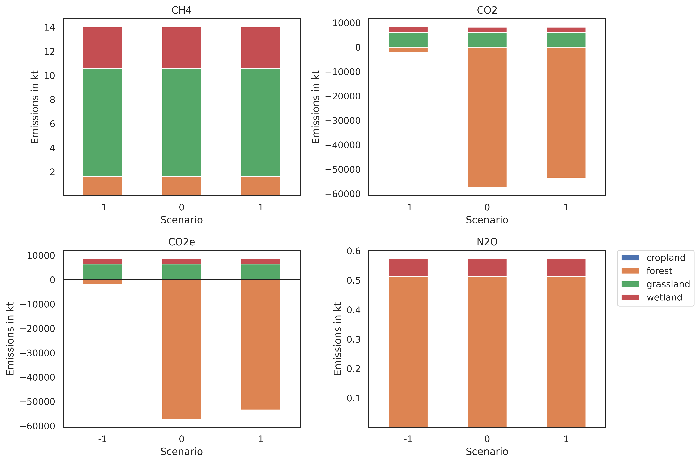
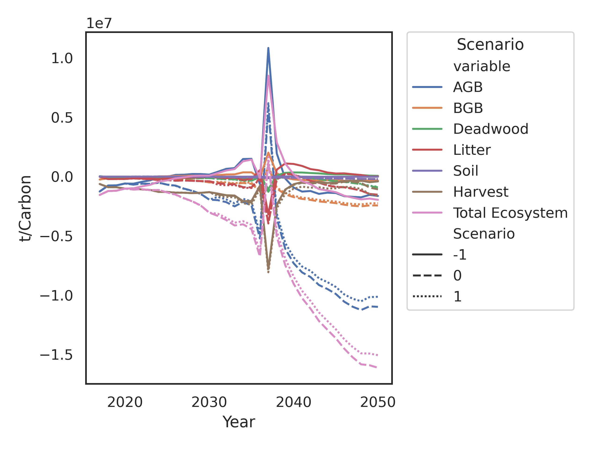
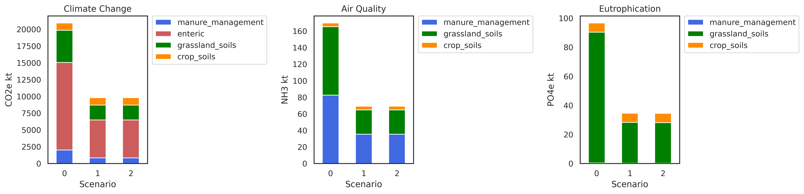

# Summary

`GOBLIN Lite` is a Python-based tool designed for evaluating land balance and AFOLU (Agriculture, Forestry, and Other Land Use) scenarios within the Irish context. It builds upon the GOBLIN framework, offering increased resolution and aligning with Ireland's National Inventory Report methodologies (including the CBM-CFS3 carbon accounting model). This integration enhances accuracy, making `GOBLIN Lite` a valuable tool for research, policymaking, and education. It calculates emissions across diverse life cycle assessment impact categories, providing policymakers and researchers with a nuanced tool to explore the environmental trade-offs of land-use decisions.

# Statement of need

Ireland's complex AFOLU emissions profile requires a modeling tool that effectively captures both major greenhouse gas (GHG) sources and sinks. `GOBLIN Lite` is designed to meet this need. Based on the original GOBLIN (General Overview for a Backcasting approach to Livestock Intensification) model [@DuffyA:2022], it calculates CO~2~ fluxes from varied soil types and forests, along with CH~4~ emissions from livestock activities. It also models nitrogen (N) losses, including N~2~O, NH~3~, and dissolved forms, across the agricultural landscape.

`GOBLIN Lite`'s enhanced resolution – in herd dynamics, soil group-specific spared area modeling, and additional impact categories – surpasses the original GOBLIN model [@DuffyA:2022]. It integrates Tier 3 forest modeling [@Kurz:2008] for increased detail and aligns with Irish National Inventory reporting [@NIR]. These features make `GOBLIN Lite` a powerful asset for policymakers, researchers, and students, as evidenced by its use in impactful "net-zero" pathway studies.

The GOBLIN modeling framework has already been used in recent studies on pathways to "net-zero" for the AFOLU sector and evaluation of "net-zero" definitions [@Bishop:2024; @DuffyB:2022].

# Model Overview

Figure 1 illustrates the model architecture and data flow. The scenario module generates model input parameters based on user data (a JSON or CSV input). These outputs are used by the livestock module to determine national livestock (cattle and sheep) numbers for each scenario. The grassland production module then calculates the area required to support these herds/flocks based on livestock energy requirements (from the cattle and sheep LCA modules) and nitrogen (N) response curves [@McEniry:2013]. The N response curve takes into account organic and inorganic fertilizer inputs, as well as soil group. System-specific utilization rates are derived from National Farm Survey data [@NFS]. The total spared area available for alternative land uses is the difference in grassland required between the scenario and the baseline. Final spared areas are disaggregated by soil group. The land use module assigns spared area and produces a transition matrix. Spared area assigned to afforestation is mapped to forest productivity classes [@Farrelly:2015].

Life Cycle Assessment (LCA) processing is handled directly within `GOBLIN Lite`. The package coordinates the flow of data and contains the impact categories. For forest emissions and removals, the CBM-CSF3 Python library is used.

# Example Output

A brief illustrative example shows a reduction in livestock with spared area being converted to forest. The example is designed to show model output and is tailored for that purpose only. Scenario -1, in all plots, denotes the baseline. Figure 2 shows emissions and removals from the climate change impact pathway for various land cover types. As spared area has been assigned to forest only emissions from grassland and wetland remain constant. In Ireland, a good deal of legacy forest has been planted on organic soils, and as such, emissions of N~2~O from forests remain relatively constant also. 

Figure 3 shows the estimation of carbon flux using the CBM-CFS3 python library. The total ecosystem is the summation of above ground biomass (ABG), below ground biomass (BGB), deadwood, litter and soils. The baseline scenario (-1) does not spare area, as such no afforestation takes place in the baseline scenario. For a detailed explanation of the GOBLIN models’ land use allocation process, see Duffy et al.[@DuffyB:2022].

Finally, Figure 4 shows the environmental impacts of agricultural production for the impact categories of climate change, air quality and eutrophication. The soils category includes both organic and inorganic inputs to soils.

{height="800pt"}

# Functionality

The `GOBLIN Lite` package allows for the calcuation of environmental impacts from agricultural production and land use change along multiple impact pathways for Ireland. The project is on going and this package, and derivitaves, are being developed further. The code presented here can be found on Github [@Github] with detailed documentation and examples. 

Overall, the `GOBLIN Lite` package aims to provide insight for policymakers, researchers and students as to the potential impacts of transistion pathways. Care must be taken when defining parameter inputs as the model will attempt to calculate whatever it is asked to. For example, exceeding the baseline livestock populations may result in a grassland area greater than the baseline grassland area. As such, it is important to ensure that parameter inputs are carefully selected. 

# Limitations
Scenario generation and execution in `GOBLIN Lite` are resource-intensive as the integration of the CBM-CFS3 adds significant computational complexity. Further, the current model does not include Harvested Wood Products. In addition, impact pathways for eutrophication and air quality apply to nutrient loads from agriculture only. Users should be aware that this model is under continuous research development and improvement. As a result, its functionalities, outputs, and interfaces may change over time. This ongoing development is aimed at enhancing the model's accuracy, efficiency, and usability.

# Acknowledgements

This research was supported by EPA Research 2030, funded by Ireland’s Environment Protection Agency under grant number EPA-CCRP-MS.57, and by Ireland’s Department of Environment, Climate and Communications under FORESIGHT land use modelling services contract.

# References