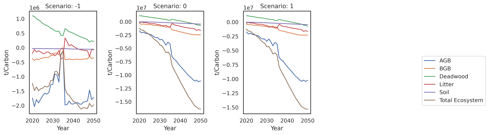

# Summary

GOBLIN Lite is a Python-based tool for evaluating land balance and AFOLU (Agriculture, Forestry, and Other Land Use) scenarios specifically tailored to the Irish context. Building upon the GOBLIN framework, it offers increased resolution and aligns with Ireland's National Inventory Report methodologies (including the CBM-CFS3 carbon accounting model). This integration enhances accuracy and makes `GOBLIN Lite` a valuable tool for research, policymaking and education. `GOBLIN Lite` calculates emissions across diverse life cycle assessment impact categories, providing policymakers and researchers with a nuanced tool to explore the environmental and economic trade-offs of land-use decisions.

# Statement of need

Ireland's complex AFOLU emissions profile necessitates a modeling tool that captures both major sources and sinks. `GOBLIN Lite` is designed for this purpose. The package is based on the original GOBLIN (General Overview for a Backcasting approach to Livestock INtensification) model [@DuffyA:2022], the package calculates CO2 fluxes from varied soil types and forests, along with CH4 emissions from livestock activities. Further, it models nitrogen (N) losses, including N2O, NH3, and dissolved forms, across the agricultural landscape.  

`GOBLIN Lite`'s enhanced resolution – in herd dynamics, soil-specific spared area modeling, and additional impact categories –  surpasses the original GOBLIN model [@DuffyA:2022]. It integrates Tier 3 forest modeling [@Kurz:2008] for additional resolution and alignment with Irish National Inventory reporting [@NIR]. This makes GOBLIN Lite a powerful asset for policymakers, researchers, and students, as evidenced by its use in impactful "net-zero" pathway studies.

The GOBLIN modeling framework has already been used in recent studies on pathways to "net-zero" for the AFOLU sector and evaluation of "net-zero definitions [@Bishop:2024; @DuffyB:2022]. 

# Model Overview

Figure 1 illustrates the model architectre and data flow. The scenario module first generates the model input paramters based on user data (a json or csv input). These outputs are utilised by the livestock module in the generation of national livestock (cattle and sheep) numbers for each of the scenarios. The grassland production module then calculates the area required to support these herds/flocks based on the lilvestock energy requirements (from the cattle and sheep LCA modules) and nitrogen (N) response curves [@McEniry: 2013]. The N response curve takes into account organic and inorganic fertiliser inputs, as well as soil type. System specific utilisation rates are derived from National Farm Survey data [@Dillon:2021]. The total spared area available for alternative land uses is then the difference in grassland required between the scenario and the baseline. Final spared areas are disaggregated by soil group. The land use module is responsible for the assignment of spared area and the production of a transition matrix. Spared area assigned to afforestation has been mapped to forest productivity classes [@Farelly:2015].

The Life Cycle Assessment (LCA) processing is handled directly in `GOBLIN Lite`. The package coordinates the flow of data and contains the impact categories. In terms of forest emissions and removals, CBM-CSF3 python library is used. 

# Example Output

A brief illustrative example shows a reduction in livestock with spared area being converted to forest. The example is designed to show model output and is tailored for that purpose only. Scenario -1, in all plots, denotes the baseline. {fig: Figure 2} shows emissions and removals from the climate change impact pathway. As spared area has been assigned to forest only emissions from grassland and wetland remain constant. In Ireland, a good deal of legacy forest has been planted on organic soils, and as such, emissions of N2O remain constant also. 

Figure 3 shows the estimation of carbon flux using the CBM-CFS3 python library. The total ecosystem is the summation of above ground biomass (ABG), below ground biomass (BGB), deadwood, litter and soils. 

Finally, Figure 4 shows the environmental impacts of agricultural production for the impact categories of climate change, air quality and eutrophication. The soils category includes both organic and inorganic inputs to soils.

# Acknowledgements

This research was supported by EPA Research 2030, funded by Ireland’s Environment Protection Agency under grant number EPA-CCRP-MS.57, and by Ireland’s Department of Environment, Climate and Communications under FORESIGHT land use modelling services contract.

# References